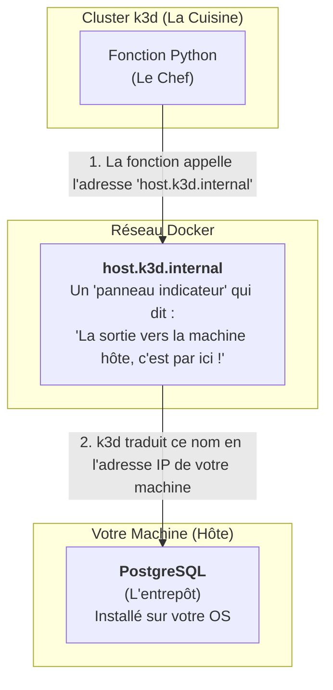

# 🏗️ Explication de l'Architecture du Projet MSPR COFRAP

Bienvenue dans ce document ! Son objectif est de démystifier l'architecture de notre projet, de vous expliquer le rôle de chaque technologie et de vous montrer comment toutes ces briques s'assemblent pour fonctionner.

## 🏢 Vue d'Ensemble : L'Analogie de l'Immeuble High-Tech

Pour commencer, imaginons que notre projet est un **immeuble d'appartements high-tech** que nous construisons. Cette image nous aidera à comprendre le rôle de chaque composant principal.

-   **k3d (Kubernetes)** : C'est le **terrain, les fondations et la structure** de l'immeuble. Il fournit l'environnement robuste et professionnel sur lequel nous allons construire.
-   **OpenFaaS (Serverless)** : C'est l'**agence de gestion de l'immeuble**. Elle s'occupe de transformer notre logique métier (notre code) en appartements fonctionnels (des API web) et gère l'accès à ces appartements.
-   **PostgreSQL** : C'est le **grand fichier central des résidents**. C'est la mémoire à long terme de notre immeuble, qui stocke de manière sécurisée qui a le droit d'entrer, les clés des appartements, etc.

---

## 🧱 Brique par Brique : Explications Détaillées

Maintenant, plongeons dans le détail de chaque technologie. Pour continuer notre fil rouge, nous utiliserons une autre analogie : celle d'un **restaurant de pizzas moderne**.

### 1. k3d : Le Local Commercial du Restaurant

**Qu'est-ce que c'est ?**
**k3d**, c'est "Kubernetes in Docker". Kubernetes est un système de niveau industriel (utilisé par Google, Netflix...) pour gérer des milliers de conteneurs. Il est extrêmement puissant, mais aussi très lourd à installer sur un simple PC. k3d est une version **légère et simplifiée** de Kubernetes, conçue pour les développeurs. Il nous permet de faire tourner un "mini-cloud" sur notre machine.

**Son rôle dans notre projet :**
-   **Le Terrain Vierge** : k3d nous fournit un "local commercial" vide. Il prépare les fondations, l'électricité, l'eau (le réseau, le stockage, la puissance de calcul).
-   **L'Orchestrateur Fiable** : C'est le propriétaire du local. Il s'assure que tout est solide. Si un conteneur "tombe en panne", Kubernetes le redémarre automatiquement, garantissant une haute disponibilité.

> **En résumé** : k3d ne fait pas tourner notre code Python directement. Il **construit et gère la cuisine professionnelle** dans laquelle notre chef (OpenFaaS) va pouvoir travailler.

---

### 2. OpenFaaS : Le Manager et le Chef de Cuisine

**Qu'est-ce que c'est ?**
**OpenFaaS** (Functions as a Service) est une plateforme "Serverless". L'idée du serverless n'est pas qu'il n'y a pas de serveurs, mais que **nous, les développeurs, n'avons pas à nous en soucier**. Nous écrivons une simple fonction, et OpenFaaS s'occupe de tout le reste.

**Son rôle dans notre projet :**
-   **Le Chef de Cuisine** : Il prend nos "recettes" (nos fonctions Python `generate-password`, `authenticate-user`...) et les transforme en plats prêts à servir (des API web sécurisées).
-   **Le Manager à l'Accueil** : Le composant "Gateway" d'OpenFaaS est le manager du restaurant. Il se place à l'entrée, prend les commandes des clients (les requêtes du frontend React) et les transmet au bon cuisinier.
-   **Gestionnaire Efficace** : Si personne ne commande une certaine pizza, le chef n'allume pas le four correspondant (la fonction est en "veille"). Si 1000 personnes commandent la même pizza, le chef met 10 cuisiniers sur le coup (OpenFaaS "scale" la fonction automatiquement).
-   **Il s'appuie sur k3d** : Pour chaque "cuisinier", OpenFaaS demande à k3d de lui fournir un poste de travail (un conteneur).

> **En résumé** : OpenFaaS est le **cerveau opérationnel** de notre restaurant. Il prend nos recettes (le code) et utilise la cuisine (k3d) pour servir les clients.

---

### 3. PostgreSQL : Le Grand Garde-Manger Sécurisé

**Qu'est-ce que c'est ?**
PostgreSQL est une base de données relationnelle. C'est un système de stockage de données ultra-fiable, structuré et sécurisé.

**Son rôle dans notre projet :**
-   **La Mémoire à Long Terme** : Un chef (une fonction serverless) a une mémoire à court terme. Une fois la pizza servie, il oublie la commande. On dit qu'il est "stateless" (sans état).
-   **Le Garde-Manger** : PostgreSQL est le grand garde-manger où l'on stocke durablement toutes les informations vitales : la liste des clients (`users`), leurs recettes secrètes (mots de passe hachés), leurs cartes de fidélité (secrets 2FA), etc.
-   **La Source de Vérité** : Quand un client revient, c'est en consultant le garde-manger que le restaurant peut le reconnaître.

> **En résumé** : PostgreSQL est le **gardien des données critiques**. Sans lui, notre service serait amnésique et inutile.

---

## 🌉 Le Pont Magique : Comment k3d Parle à la Base de Données Locale

C'est l'un des points les plus techniques et importants à comprendre. Comment nos fonctions, qui vivent dans le "mini-cloud" k3d, peuvent-elles parler à notre base de données, qui vit directement sur notre PC ?

La connexion est possible grâce à un "pont" construit sur 3 piliers :



1.  **L'Adresse Spéciale (`host.k3d.internal`)**
    -   Quand une fonction s'exécute dans un conteneur k3d, elle est isolée. Pour lui permettre de "sortir" et de parler à la machine qui l'héberge, k3d crée un nom de domaine magique : `host.k3d.internal`. C'est l'adresse que nous avons mise dans `stack.yaml` (`DB_HOST`).

2.  **La Porte Ouverte (`listen_addresses = '*'`)**
    -   Par défaut, PostgreSQL est paranoïaque et n'écoute que les appels venant de lui-même (`localhost`). En changeant ce paramètre pour `*`, on lui dit d'ouvrir grand ses portes et d'accepter les connexions qui viennent de n'importe où, y compris du pont k3d.

3.  **Le Gardien à l'Entrée (`pg_hba.conf`)**
    -   Même si la porte est ouverte, un gardien vérifie les identités. En ajoutant la ligne `host all all 0.0.0.0/0 md5`, nous donnons au gardien la consigne suivante : "Laisse entrer n'importe qui (`0.0.0.0/0`), à condition qu'il te donne le bon mot de passe (`md5`)."

C'est cette combinaison qui rend la communication possible et sécurisée.

---

## 🤔 Choix d'Architecture : Pourquoi une Base de Données Locale ?

Une question légitime est : "Pourquoi ne pas mettre aussi la base de données dans un conteneur Docker ?"

**Réponse courte : Pour la simplicité et la rapidité du développement dans le cadre de ce MSPR.**

-   **Votre approche (DB locale)** est comme construire une **maquette d'architecture**. Vous utilisez les outils sur votre bureau pour être rapide et efficace. C'est parfait pour démontrer le concept.
-   **L'approche "Production" (DB en conteneur)** est comme construire le **vrai bâtiment**. Chaque pièce est standardisée (conteneurisée) pour être robuste et reproductible.

Pour ce projet, où l'accent est mis sur l'architecture **serverless et sécurisée**, utiliser une base de données locale est un choix pragmatique et intelligent. Il nous a permis de nous concentrer sur le cœur du sujet sans ajouter la complexité de la gestion d'un conteneur de base de données.

Nous espérons que ce document vous aidera à mieux comprendre les rouages de ce projet passionnant !

---

## ⚙️ Le Backend : Comment ça Marche Sans Flask ni Django ?

Une question très importante se pose : quel framework web Python utilisons-nous pour le backend ? Flask ? Django ? FastAPI ?

La réponse est : **aucun d'entre eux**. Notre backend ne ressemble pas à une application web traditionnelle. Il est entièrement bâti sur le modèle "Functions as a Service" fourni par OpenFaaS.

### La Différence Fondamentale avec un Framework Classique

Dans une application classique avec Flask, **vous** êtes responsable de créer et de gérer le serveur web :
```python
# Exemple avec Flask - CE QUE NOUS NE FAISONS PAS
from flask import Flask, request

app = Flask(__name__) # Vous créez l'application

@app.route('/generate-password', methods=['POST']) # Vous définissez les routes
def generate_password_route():
    # Votre logique ici
    return {"password": "..."}

if __name__ == '__main__':
    app.run(host='0.0.0.0', port=5000) # Vous lancez le serveur
```

Dans notre projet, tout ce code "d'infrastructure" (créer l'application, définir les routes, lancer le serveur) **n'existe pas**. Il est entièrement pris en charge par la plateforme **OpenFaaS**.

### Le Rôle du Template `python3-http`

Le secret de notre architecture backend réside dans la ligne `lang: python3-http` de notre fichier `stack.yaml`. En choisissant ce "template", nous demandons à OpenFaaS de faire le travail suivant pour nous :

1.  **Créer un Mini-Serveur Web** : Pour chaque fonction, OpenFaaS construit une image Docker contenant Python et un tout petit serveur web ultra-léger et optimisé.
2.  **Gérer le Point d'Entrée** : Ce serveur est pré-programmé pour faire une seule chose : recevoir une requête HTTP, et la passer à une fonction unique nommée `handler` qui doit se trouver dans un fichier `handler.py`.
3.  **Simplifier notre Travail** : Notre seul rôle en tant que développeur backend est donc d'écrire la logique métier pure à l'intérieur de cette fonction `handler`.

Voici à quoi ressemble notre code :
```python
# generate-password/handler.py

# On importe les objets Request et Response fournis par le template OpenFaaS
from faas_http import Request, Response
import json
# ... autres imports ...

# Voici notre SEUL point d'entrée. C'est tout notre "backend".
def handler(req: Request) -> Response:
    """
    Traite une requête vers la fonction.
    """
    try:
        # 1. On récupère le corps de la requête
        body = req.get_json()
        username = body.get("username")

        # ... toute notre logique ...

        # 2. On prépare une réponse
        response_data = {"success": True, "password": "a-new-password"}
        
        # 3. On retourne un objet Response avec le statut 200 (OK)
        return Response(json.dumps(response_data), status_code=200)

    except Exception as e:
        # En cas d'erreur, on retourne un objet Response avec le statut 500
        return Response(json.dumps({"success": False, "error": str(e)}), status_code=500)
```

**Ce qui est remarquable, c'est ce qui est absent :**
-   Aucune création d'application (`app = Flask(...)`).
-   Aucune définition de route (`@app.route(...)`).
-   Aucun lancement de serveur (`app.run()`).

Nous nous concentrons uniquement sur la logique métier, et OpenFaaS gère toute la complexité du serveur web.

### L'Analogie de la Cuisine "Fantôme" (Ghost Kitchen)

Pour bien visualiser la différence, voici l'analogie la plus proche :

-   **Une application Flask/Django** : C'est comme être un chef qui ouvre son **propre food truck**. Vous devez acheter le camion (le serveur), choisir où vous garer (définir les routes), gérer le moteur et l'essence (lancer et maintenir le processus serveur), ET cuisiner.

-   **Une fonction OpenFaaS** : C'est comme être un chef qui travaille pour une **cuisine "fantôme" ultra-moderne** (une "ghost kitchen").
    -   Le propriétaire de la cuisine (OpenFaaS) vous fournit un poste de travail parfaitement équipé et standardisé.
    -   Vous ne vous souciez ni des murs, ni de l'électricité, ni de la plomberie.
    -   Un écran devant vous affiche une commande (l'objet `Request`).
    -   Votre unique travail est de **préparer le plat** en suivant la commande (votre logique dans la fonction `handler`).
    -   Une fois le plat prêt, vous le posez sur le comptoir (vous retournez un objet `Response`), et un livreur (le Gateway OpenFaaS) s'occupe de l'amener au client. Vous êtes immédiatement prêt pour la prochaine commande.

**En conclusion :** Le backend de notre projet n'est pas une application monolithique. C'est une **collection de micro-fonctions indépendantes**, où toute la complexité du "serveur web" est abstraite par la plateforme OpenFaaS. C'est la puissance et l'élégance du modèle "Functions as a Service". 


Installer kubeseal (CLI) – une fois
wget https://github.com/bitnami-labs/sealed-secrets/releases/download/v0.23.1/kubeseal-0.23.1-linux-amd64.tar.gz
tar -xzf kubeseal-0.23.1-linux-amd64.tar.gz
sudo mv kubeseal /usr/local/bin/
kubeseal --version # vérification
Installer le contrôleur Sealed-Secrets dans le cluster – une fois
kubectl apply -f https://github.com/bitnami-labs/sealed-secrets/releases/download/v0.23.1/controller.yaml
────────── 2. Création & scellement des secrets ──────────
Générer la clé AES-256 pour 2FA
export MFA_KEY_B64=$(openssl rand -base64 32)
Sceller le mot de passe DB
kubectl create secret generic db-creds \
--namespace openfaas-fn \
--from-literal=DB_PASSWORD=mspr_password \
--dry-run=client -o yaml | \
kubeseal --namespace openfaas-fn --format yaml > sealed-db-creds.yaml
Sceller la clé 2FA
kubectl create secret generic mfa-key \
--namespace openfaas-fn \
--from-literal=MFA_KEY_B64=$MFA_KEY_B64 \
--dry-run=client -o yaml | \
kubeseal --namespace openfaas-fn --format yaml > sealed-mfa-key.yaml
Appliquer dans le cluster
kubectl apply -f sealed-db-creds.yaml
kubectl apply -f sealed-mfa-key.yaml
────────── 3. Lancement / relance quotidienne ──────────
./start_full_demo.sh # script principal (build, deploy, frontend)
────────── 4. Commandes de maintenance utiles ──────────
Vérifier l’état des fonctions
faas-cli list --gateway http://127.0.0.1:8088